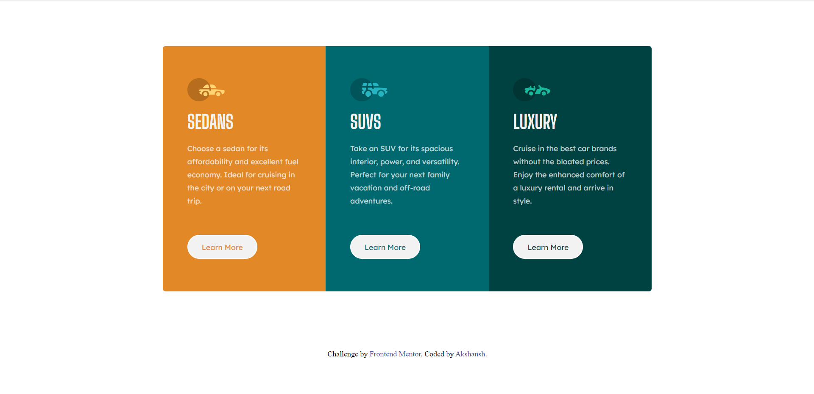
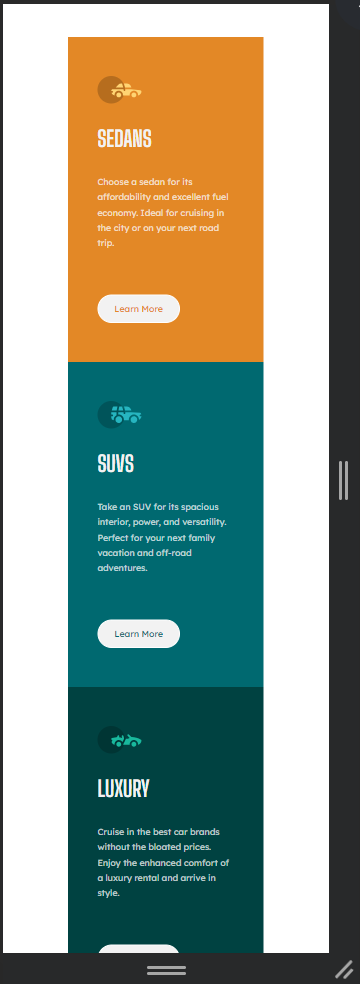

# Frontend Mentor - Results summary component solution

This is a solution to the Results summary component challenge on Frontend Mentor.

## Table of contents

- [Overview](#overview)
  - [The challenge](#the-challenge)
  - [Screenshot](#screenshot)
- [My process](#my-process)
  - [Built with](#built-with)
  - [Continued development](#continued-development)

## Overview

### The challenge

Users should be able to:

- View the optimal layout for the interface depending on their device's screen size
- See hover and focus states for all interactive elements on the page

### Screenshot

### Links

- Solution URL: https://www.frontendmentor.io/solutions/solution-of-3column-preview-card-component-ZGhegab5ys
- Live Site URL: https://effervescent-boba-6278b6.netlify.app/

## My process

I started my process by dividing the layout into divs and started coding by writing HTML code and after completing HTML, I started with CSS from top to bottom flow and I used Grid layout for the 3 column design.

### Built with

- Semantic HTML5 markup
- CSS custom properties
- Flexbox
- CSS Grid

### Continued development

I still need to learn more about CSS grid layout and responsiveness using media queries.
